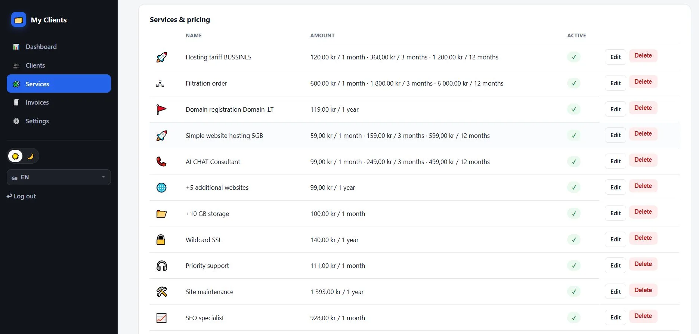
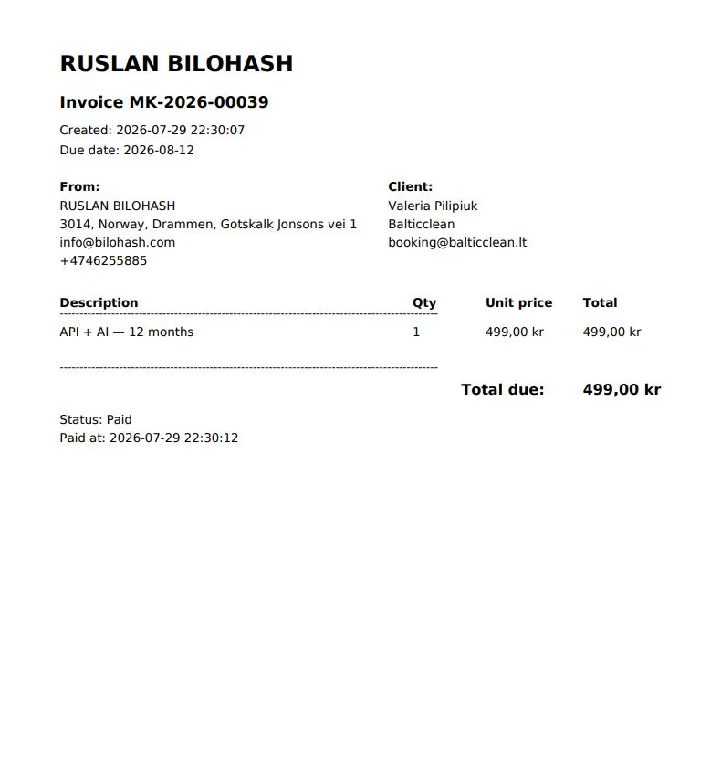
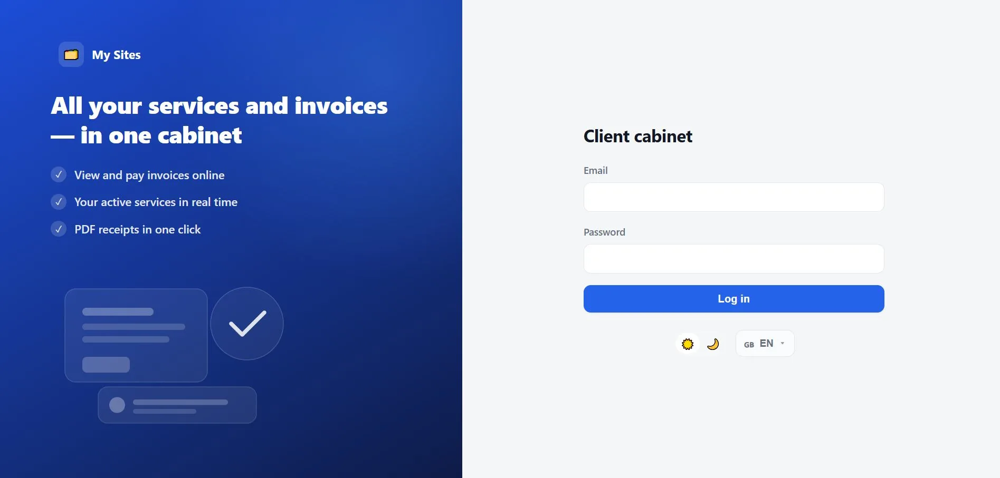

# My Clients

**PHP product for client management, service catalog, Invoice billing, tax (VAT / MVA / PVM / ПДВ), online payments (Stripe & PayPal), and a client cabinet.**

| | |
|---|---|
| **Live landing** | https://bilohash.com/myclient/ |
| **Live demo** | https://bilohash.com/myclient/cms/portal.php |
| **Version** | **1.0.0** |
| **Author** | [BILOHASH](https://bilohash.com/) · [Ruslan Bilohash](https://github.com/Ruslan-Bilohash) |
| **License** | See repository (demo portfolio product) |

### Read this in other languages
- [English (this file)](README.md)
- [Українська](readme-ua.md)
- [Русский](readme-ru.md)
- [Norsk](readme-no.md)
- [Lietuvių](readme-lt.md)

---

## Screenshots

| Client cabinet | Admin clients | Invoice |
|:---:|:---:|:---:|
|  |  |  |

| Services pricing | PDF invoice | Client login |
|:---:|:---:|:---:|
|  |  |  |

Full set (WebP + thumbs): [`screenshot/`](screenshot/) — also on the [live gallery](https://bilohash.com/myclient/#shots).

---

## What it does

**My Clients** is a lightweight PHP 8 application (JSON storage, no MySQL required) for freelancers and small agencies who bill recurring services.

### Admin
- **Clients** — CRUD, company, site/domain, language, status, notes, cabinet password
- **My services** — catalog with multi-language names, icons, prices for **1 / 3 / 12 months**
- **Invoices** — line items, tax, statuses `pending` / `paid` / `cancelled`, email, PDF
- **Company details** — seller block on PDF / receipts
- **Tax** — enable % (VAT / MVA / PVM / ПДВ naming by market)
- **FX** — optional display rates
- **Payments** — Stripe Checkout + PayPal REST keys in Admin → Settings

### Client cabinet
- Own login
- Active services
- Invoice list → pay online → download PDF
- Profile / password

### Landing page
- SEO multi-lang (UK, RU, EN, NO, SV, PL)
- Feature copy, FAQ, Schema.org, OG images, screenshot lightbox
- Links to demo portal and install

---

## Demo credentials

> Public **portfolio demo** only. Not real billing. Not real payments.

| Role | URL | Login | Password |
|------|-----|-------|----------|
| Portal | [/cms/portal.php](https://bilohash.com/myclient/cms/portal.php) | — | — |
| Admin | [/cms/admin/login.php](https://bilohash.com/myclient/cms/admin/login.php) | `demo` | `demo` |
| Client | [/cms/login.php](https://bilohash.com/myclient/cms/login.php) | `anna.berg@demo.myclient` | `demo` |

---

## Requirements

- PHP **8.0+** (recommended 8.1+)
- Extensions: `json`, `mbstring`, `openssl` (for payments), writable `cms/data/`
- Optional: `curl` for Stripe / PayPal API calls
- Web server: Apache (`.htaccess`) or nginx equivalent
- No database server required (JSON files)

---

## Quick install

1. Upload the `cms/` folder (or whole repo) to your host.
2. Point the document root or URL path to `cms/`.
3. Ensure `cms/data/` is writable and blocked from public listing (`.htaccess` included).
4. Open `cms/install.php` (if enabled) **or** use demo data and change admin password.
5. Configure **Admin → Settings**: company details, tax, Stripe / PayPal keys.
6. Optional: copy `cms/data/config.local.example.php` → `config.local.php` for base URL overrides.

```text
myclient/
├── index.php              # Product landing (SEO)
├── changelog.php          # Public changelog HTML
├── screenshot/            # UI screenshots (WebP)
├── docs/screenshots/      # README images
├── assets/css/site.css
├── llms.txt
├── README.md              # English (primary)
├── readme-ua.md / ru / no / lt
├── CHANGELOG.md
├── VERSION
└── cms/                   # Application
    ├── admin/             # Admin panel
    ├── includes/          # Core PHP modules
    ├── lang/              # UI translations
    ├── data/              # JSON storage (+ demo)
    ├── assets/            # CSS, JS, fonts
    ├── portal.php         # Demo entry
    ├── install.php.off    # Install wizard (rename to enable)
    ├── VERSION
    └── CHANGELOG.md
```

---

## Capabilities (summary)

| Module | Capability |
|--------|------------|
| Clients | Create, edit, disable; cabinet access |
| Services | Pricing periods m1 / m3 / m12 |
| Invoices | Lines, tax, PDF, email, payment link / QR |
| Tax | Global % applied to new invoices |
| Pay | Stripe Checkout, PayPal |
| i18n | App UI: UK, NO, EN · Landing: UK, RU, EN, NO, SV, PL |
| PDF | Unicode (DejaVu), seller + client blocks |
| Storage | JSON files under `cms/data/` |

---

## Names by market

| Lang | Product name |
|------|----------------|
| EN | **My Clients** |
| UK | **Мої клієнти** |
| RU | **Мои клиенты** |
| NO | **Mine kunder** |
| LT | **Mano klientai** |

---

## Security notes

- Never commit live Stripe / PayPal secrets. Use Admin → Settings or empty placeholders.
- Keep `cms/data/` non-public.
- Change demo passwords on any real deployment.
- CSRF tokens are required on state-changing forms.

---

## Changelog & releases

- Full history: [CHANGELOG.md](CHANGELOG.md)
- On-site: https://bilohash.com/myclient/changelog.php
- GitHub releases: https://github.com/Ruslan-Bilohash/myclient/releases

---

## Related

- Ecosystem join: https://bilohash.com/ecosystem/join.php  
- Contact: https://bilohash.com/contact.php  
- News: https://bilohash.com/news.php  

---

## Disclaimer

This repository includes a **public portfolio demo**. Sample clients, invoices, and company data are fictional. Do not treat demo payments as production financial processing until you configure your own keys and legal entity details.
