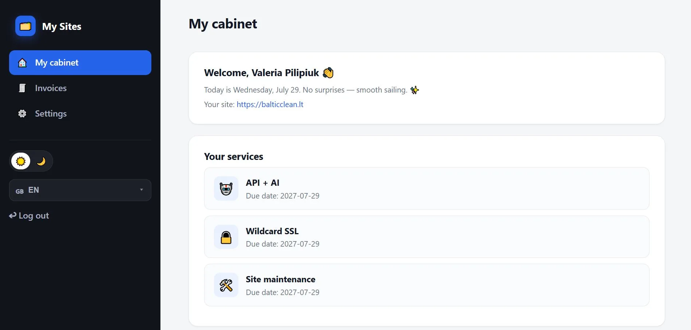
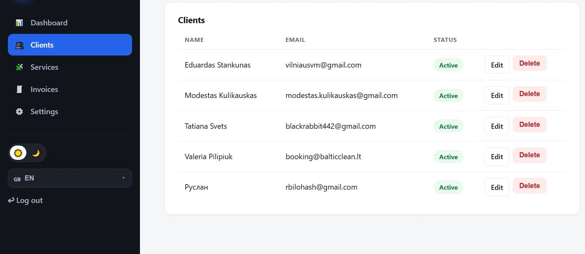
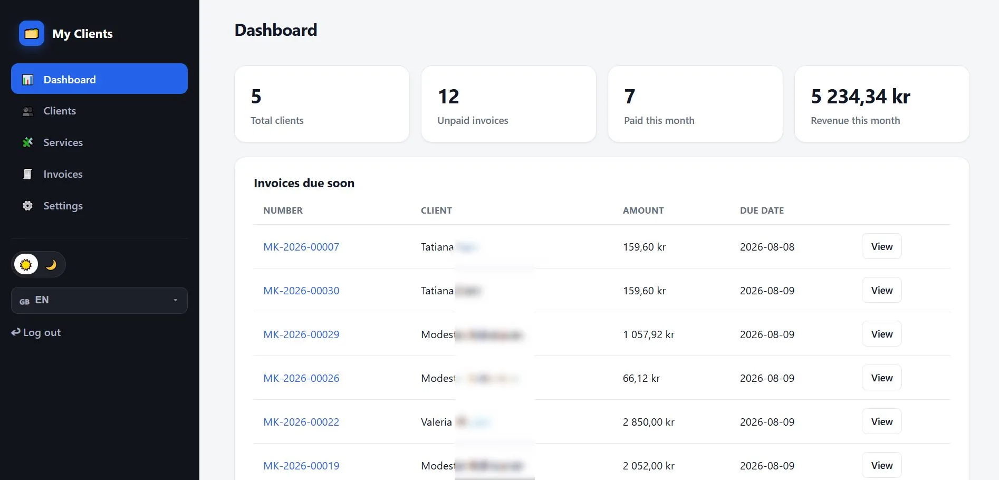

# Mano klientai (My Clients)

**PHP produktas klientų valdymui, paslaugų katalogui, Invoice sąskaitoms, mokesčiams (PVM / VAT / MVA), mokėjimams internetu (Stripe ir PayPal) ir kliento kabinetui.**

| | |
|---|---|
| **Landing** | https://bilohash.com/myclient/?lang=en |
| **Demo** | https://bilohash.com/myclient/cms/portal.php |
| **Versija** | **1.0.0** |
| **Autorius** | [BILOHASH](https://bilohash.com/) |
| **Parama / donatas** | https://bilohash.com/donate.php |

### Kitos kalbos
- [English (pagrindinis README)](README.md)
- [Українська](readme-ua.md)
- [Русский](readme-ru.md)
- [Norsk](readme-no.md)
- [Lietuvių (šis failas)](readme-lt.md)

---

## Ekrano nuotraukos

| Kliento kabinetas | Klientai (admin) | Sąskaita |
|:---:|:---:|:---:|
|  |  |  |

Visas rinkinys: [`screenshot/`](screenshot/) · [galerija](https://bilohash.com/myclient/#shots)

---

## Galimybės

### Administratorius
- **Klientai** — CRUD, įmonė, svetainė/domenas, kalba, statusas, pastabos, kabineto slaptažodis
- **Mano paslaugos** — katalogas, piktogramos, kainos **1 / 3 / 12 mėn.**, daugiakalbiai pavadinimai
- **Invoice** — eilutės, mokestis, statusai pending / paid / cancelled, el. paštas, PDF
- **Pardavėjo rekvizitai** — PDF / kvitui
- **Mokestis** — procentas (PVM / VAT / MVA)
- **Mokėjimas** — Stripe Checkout ir PayPal REST (raktai nustatymuose)

### Kliento kabinetas
- Atskirras prisijungimas
- Aktyvios paslaugos
- Sąskaitų sąrašas → mokėti internetu → atsisiųsti PDF
- Profilis / slaptažodis

### Produkto puslapis
- SEO: UK, RU, EN, NO, SV, PL
- Schema.org, Open Graph, ekrano nuotraukų lightbox
- DUK, moduliai, demo nuorodos

---

## Demo prisijungimai

> Viešas **portfolio demo**. Ne tikras atsiskaitymas ir ne tikri mokėjimai.

| Rolė | Prisijungimas | Slaptažodis |
|------|----------------|-------------|
| Admin | `demo` | `demo` |
| Klientas | `anna.berg@demo.myclient` | `demo` |

Portalas: https://bilohash.com/myclient/cms/portal.php

---

## Reikalavimai

- PHP **8.0+**
- `json`, `mbstring`, rašoma `cms/data/`
- **Duomenų bazė nereikalinga** (JSON failai)

---

## Greitas diegimas

1. Įkelkite `cms/` (arba visą repozitoriją) į hostingą.
2. Padarykite `cms/data/` rašomą ir uždarą nuo katalogo sąrašo.
3. Paleiskite diegimo vedlį (jei įjungtas) arba pakeiskite demo admin slaptažodį.
4. **Admin → Nustatymai**: įmonė, mokestis, Stripe / PayPal.
5. Pasirinktinai: `config.local.example.php` → `config.local.php`.

---

## Struktūra

```text
myclient/
├── index.php           # SEO landing
├── screenshot/         # UI nuotraukos
├── docs/screenshots/   # README paveikslėliai
├── CHANGELOG.md
├── VERSION
└── cms/                # Programa (admin + kabinetas)
```

---

## Pakeitimų žurnalas ir leidimai

- [CHANGELOG.md](CHANGELOG.md)
- https://bilohash.com/myclient/changelog.php
- https://github.com/Ruslan-Bilohash/myclient/releases

---

## Parama

Paremti autorių: https://bilohash.com/donate.php

---

## Atsakomybės apribojimas

Repozitorijoje yra **viešas portfolio demo**. Duomenys išgalvoti. Nenaudokite demo mokėjimų kaip gamybinio atsiskaitymo, kol nenustatysite savo raktų ir įmonės duomenų.
